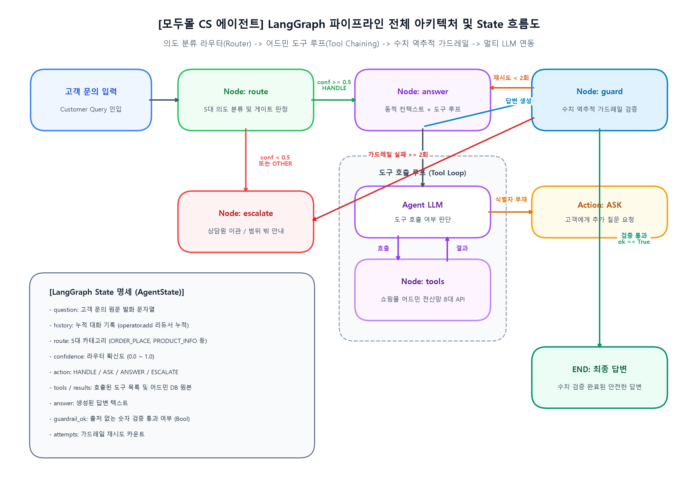
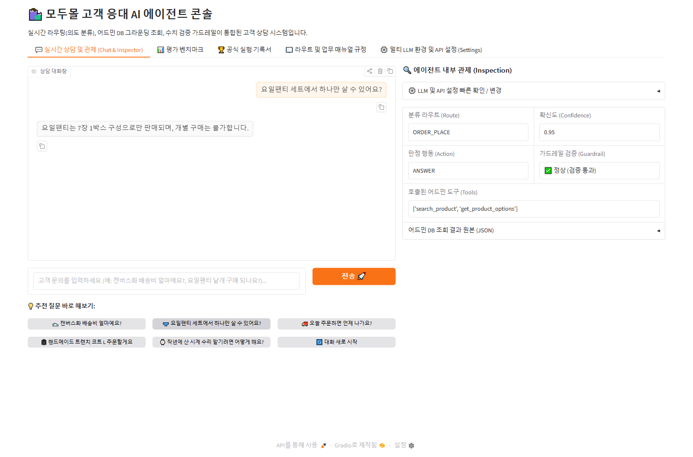

# 🛍️ 모두몰 고객응대 AI 에이전트 (ModuMall CS Agent)

고객 문의 한 줄을 받아 **의도를 분류하고 → 어드민 전산 DB에서 조회하고 → 업무 매뉴얼에 근거해 검증된 답변을 제공하는** 실시간 고객 상담 AI 에이전트 시스템입니다.



---

## 🎯 프로젝트가 지향하는 5가지 핵심 원칙 (Architecture)

```
[고객 입력] ──► [① 카테고리 판정] ──(확신도 미달)──► [② 안전 최우선 넘기기 (상담원 이관)]
                       │ (정상 판정)
                       ▼
              [③ 카테고리별 근거 조립] (매뉴얼 발췌 + 어드민 DB 조회)
                       │
                       ▼
              [④ 근거만으로 절제된 답변] (지레짐작 / 환각 차단)
                       │
                       ▼
              [⑤ 기계적 수치 검증 (가드레일)] ──(위반 시 재생성 / 이관)
```

1. **정확한 카테고리 판정 (Precision Routing)**:  
   고객 문의의 핵심 의도를 5개 분과(`ORDER_PLACE`, `PRODUCT_INFO`, `SHIPPING`, `RETURN_REFUND`, `OTHER`)로 엄밀하게 분류합니다.
2. **안전 최우선 상담원 이관 ("모르겠으면 넘기기")**:  
   의도가 모호하거나 확신도(`confidence`)가 기준치(0.5) 미만인 경우, 지레짐작으로 답하지 않고 인간 전문 상담사에게 즉시 이관(`ESCALATE`)합니다.
3. **카테고리별 동적 근거 조립 (Dynamic Context Assembly)**:  
   방대한 매뉴얼 전문을 몽땅 주입하지 않고, 판정된 카테고리에 꼭 필요한 매뉴얼 조항과 어드민 DB 전산 데이터만 선별하여 프롬프트에 조립합니다.
4. **철저한 근거 기반 답변 (Grounded & Controlled Answer)**:  
   실제 조회된 DB 전산 수치와 매뉴얼 규정에만 근거하여 답변하며, 규격화된 표현(금액 아라비아 숫자, 필수 표준어)을 준수합니다.
5. **기계적 수치 검증 가드레일 (Strict Numerical Guardrail)**:  
   답변 속 모든 금액 및 수치를 역추적하여, DB나 매뉴얼에 없는 출처 불명의 숫자가 섞여 나오면 고객에게 노출되기 전에 즉시 차단합니다.

---

## 📋 5가지 필수 구현 요구사항 및 반영 명세

### 1. 카테고리를 정하고 문서와 연결하기
- **4+1 카테고리 구성**: 실제 쇼핑몰 CS 업무 분과 및 규정 구조에 맞추어 `ORDER_PLACE`(주문/구매), `PRODUCT_INFO`(상품스펙), `SHIPPING`(배송), `RETURN_REFUND`(반품/환불), 그리고 어디에도 속하지 않는 예외를 위한 `OTHER`를 정의했습니다.
- **문서 매핑표 ([`context.py`](context.py))**: `SECTION_MAP`을 통해 각 카테고리가 매뉴얼 1~7장의 어느 조항을 참조해야 하는지 1:1 매핑표를 구축하고, 동적으로 프롬프트를 조합합니다.

### 2. 평가셋 만들기
- **균형 잡힌 골든셋 구축**: `answer_goldenset_multiturn.json`에 20건 이상(34건)의 다회차 문의 문항을 카테고리별로 고르게 배치했습니다.
- **문항별 3축 검증 요소**:
  - `tools`: 반드시 호출해야 하는 기대 전산 도구
  - `must`: 답변에 반드시 포함되어야 할 핵심 사실 (예: `"40,000"`, `"품절"`, `"주문 제작"`)
  - `forbid`: 문서를 제대로 읽지 않았을 때 나오기 쉬운 그럴듯한 오답 및 한글 금액 표기
- **이관 문항 및 예외 케이스 포함**: 외부 제휴몰 주문(`is_external_channel`)이나 제조사 A/S 등 '답변하지 않고 넘기는 것'이 정답인 문항(`OUT_OF_SCOPE`, `ESCALATE`)을 섞어 안전 경로를 평가합니다.
- **엄격한 데이터 분리**: 프롬프트 예시용 `fewshot`(40건)과 성능 측정용 `eval`(120건 / 34건)을 엄격히 분리하여 데이터 오염을 방지했습니다.

### 3. 파이프라인 구현
- **단일 LangGraph 파이프라인 ([`agent.py`](agent.py))**: `판정(route) → 근거 조립 및 조회(answer) → 수치 검증(guard) → 답변 출력/이관`을 하나의 유기적인 상태 그래프로 연결했습니다.
- **분류(`classify`)와 게이트(`gate`)의 분리 ([`router.py`](router.py))**: 카테고리를 예측하는 LLM 노드와, 확신도를 보고 이관 여부를 결정하는 정책 노드를 분리하여 유연한 임계값 튜닝을 지원합니다.
- **기계적 수치 검사기 ([`guardrail.py`](guardrail.py))**: 정규식을 통해 답변 속 숫자를 추출하고 허용 집합(DB 결과 + 매뉴얼 고정값 + 산술 연산값)과 대조 검사합니다.

### 4. 측정 (Evaluation)
- **도구 호출 적절성**: 기대 도구와 실제 호출 도구 집합이 정확히 일치할 때만 점수를 부여합니다.
- **답변 적절성**: `must`는 모두 충족하고 `forbid`는 단 하나도 위반하지 않았는지를 채점합니다.
- **채점기 자기 검증 ([`evaluate.py`](evaluate.py))**: 평가 시작 전 모범 답안(Reference)을 먼저 채점하여 채점기 자체의 무결성을 항상 보증합니다.
- **실패 사례 분석 및 기록**: 실패 문항의 원인을 `fails_detail.json` 및 GUI 대시보드에 기록하며, 한 번에 하나씩 변경하며 성능 추이를 추적했습니다.

### 5. 데모 만들기

본 프로젝트는 실무 운영자가 브라우저에서 직관적으로 검수하고 실험할 수 있도록 Gradio 기반의 웹 대시보드([`app_gui.py`](app_gui.py) / [`app_hitl.py`](app_hitl.py))를 제공합니다.

#### 5-1. 🛡️ 사람이 승인하는 에이전트 (HITL 발송 승인 심사대)
고객에게 공식 알림톡/문자 답변이 발송되기 직전, 위험 기준에 걸린 건을 멈추고(`interrupt`) 담당자가 **10초 안에 판단**하여 4가지 방식으로 조치할 수 있는 전용 심사대입니다.


* **10초 신속 판단을 위한 5대 핵심 정보 카드**:
  1. **① 고객 문의 원문**: 실제 인입된 고객의 질문 문장 그대로 노출
  2. **② 의도 분류 및 확신도**: AI의 분류 분과 및 확신도 수치 (기준 0.70 미달 시 붉은색 경고 표시)
  3. **③ AI 발송 답변 초안 및 근거 규정**: AI가 작성한 초안과 근거로 인용한 사내 공식 매뉴얼 조항(`제N조`) 대조
  4. **④ 발송 직전 멈춘 이유**: 에이전트가 멈춘 명확한 위험 사유 (예: `분류 확신도 0.58 미달`, `민감 분쟁 키워드 감지`)
  5. **⑤ 통과시키면 일어나는 일 (가장 중요)**: `"고객의 카카오톡으로 해당 답변이 즉시 공식 발송됩니다."` 경고 문구로 승인의 무게감 부여
* **담당자 4대 조치 버튼 (Action Buttons)**:
  * `[1. 승인]`: AI 초안 그대로 고객에게 즉시 공식 알림톡 전송 (녹색)
  * `[2. 수정 후 승인]`: 오탈자나 미흡한 문구를 인라인 에디터에서 직접 고쳐서 발송 (실무 최다 빈도)
  * `[3. 반려]`: 오답 발송을 원천 차단하고 고객에게 '전문 상담사 유선 상담 예정' 안내 후 상담원 티켓 이관
  * `[4. 다시 판정]`: 지시 메모("더 정중한 어조로 규정 제3조를 명시해줘")를 주어 AI 답변 재작성
* **대기 건 SQLite 영속 보관**: `SqliteSaver` 파일 체크포인터를 탑재하여 서버 재부팅 시에도 미처리 대기 건이 안전하게 유지됩니다.

---

#### 5-2. 📊 멈춤 기준 검증 벤치마크 (기준별 비교표)
"기준을 정했다고 끝이 아닙니다." 멈춤 기준이 실제로 어떤 사고를 막고 어떤 피로를 유발하는지 3대 핵심 지표로 실시간 측정 및 시뮬레이션합니다.


* **3대 핵심 검증 지표**:
  * **개입률**: 전체 중 사람에게 온 비율 (담당자의 업무 부하)
  * **🚨 놓침 (가장 비싼 위험 실수)**: 사람이 봤어야 하는데 자동으로 나가버린 치명적 오안내/분쟁 건
  * **⚠️ 헛멈춤 (피로도)**: 볼 필요가 없는데 사람에게 온 불필요한 호출
* **6대 기준별 시뮬레이션**:
  * 단일 기준(키워드만, 확신도만)의 한계를 분석하고, **복합 기준(확신도 0.70 미만 + 규정 미인용 + 분쟁 키워드)** 적용 시 **놓침 0건, 헛멈춤 0건(골든 룰)**을 달성함을 수치로 증명합니다.
  * 관리자가 슬라이더로 임계치를 조절하며 즉시 비교표를 재계산할 수 있는 인터랙티브 시뮬레이터를 제공합니다.

---

#### 5-3. 💬 실시간 고객 상담 및 내부 관제 (Chat & Inspector)
고객 문의 한 줄을 입력하면 의도 분류부터 전산 DB 조회, 가드레일 검증까지의 전 과정을 실시간으로 관제합니다.



* **투명한 내부 관제 패널**: 고객 답변뿐만 아니라 분류된 라우트, 확신도 점수, 판정 행동(`Action`), 호출된 도구 목록, 가드레일 검증 통과 여부, 어드민 DB 원본 JSON 데이터를 실시간으로 투명하게 공개합니다.
* **보안 격리**: API 키는 [`.env`](.env.example) 템플릿 안내에 따라 개별 로컬 환경에서만 관리되며 [`.gitignore`](.gitignore)를 통해 GitHub에 절대 유출되지 않습니다.

---

## ⚡ 멀티 LLM 지원 (Multi-Provider)

OpenAI 뿐만 아니라 다양한 LLM 공급자를 GUI 설정 화면에서 원클릭으로 전환하여 사용할 수 있습니다:
* **🟢 OpenAI**: `gpt-4o`, `gpt-4o-mini` 등
* **🟣 Anthropic (Claude)**: `claude-3-7-sonnet`, `claude-3-5-haiku` 등
* **🔵 Google (Gemini)**: `gemini-2.5-pro`, `gemini-2.5-flash` 등
* **🟠 로컬 LLM (Ollama)**: `llama3.1`, `qwen2.5` 등 (로컬 PC 오프라인 구동)

---

## 🚀 5분 만에 시작하기

### 1. 설치 및 환경 설정
```bash
pip install -r requirements.txt
cp .env.example .env        # .env 파일에 사용할 LLM API Key 입력
```

### 2. 실행 모드
```bash
# ① 웹 GUI 대시보드 실행 (app.py 또는 app_gui.py 둘 다 가능)
python app.py

# ② 콘솔 대화 모드
python chat.py

# ③ 성능 벤치마크 평가 측정
python evaluate.py
```

---

## 🛡️ 사람이 승인하는 에이전트 (HITL, Human-in-the-Loop) 시스템

> **"결과가 바깥으로 나가는 순간 되돌리기 어려운 일은 위험한 건에서만 멈추고 사람의 확인을 받는다."**

고객에게 카카오 알림톡이나 공식 문자 답변을 전송하는 일은 **결과가 바깥으로 나가는 비가역적(Irreversible) 액션**입니다. AI가 99% 정확해도 남은 1%의 잘못된 규정 안내나 분쟁성 발언은 고객 이탈과 법적 분쟁으로 직결됩니다. 이에 따라 LangGraph의 `interrupt()`와 `Command(resume=...)`, 영속 `SqliteSaver`를 활용한 **고객 답변 발송 전 HITL 승인 파이프라인**을 구축했습니다.

### 1. 좋은 승인 화면의 5대 필수 요소 (10초 판단 원칙)
담당자가 별도 어드민 시스템을 뒤지지 않고 **10초 안에 승인/반려/수정**을 결정할 수 있도록 구성:
1. **고객 문의 원문**: `"배송 지연으로 행사를 망쳤으니 전액 배상하고 소비자원에 고소하기 전에 대표랑 통화하게 해주세요."`
2. **의도 분류 및 확신도**: `SHIPPING` | `확신도: 0.89`
3. **AI 발송 답변 초안 및 인용 규정**: 공식 매뉴얼 조항(`배송규정 제7조`)과 답변 본문 대조
4. **에이전트가 멈춘 이유**: `⚠️ 민감 분쟁 키워드 감지 ('소비자원', '고소', '대표')`
5. **통과시키면 일어나는 일 (가장 중요)**: `"고객(정다은님)의 카카오톡으로 해당 답변이 즉시 공식 발송됩니다."`

### 2. 담당자 4대 응답 설계
- `[1. 승인]`: AI 초안 그대로 고객에게 공식 알림톡 즉시 발송
- `[2. 수정 후 승인]`: 담당자가 문구를 정중하게 다듬거나 보상 쿠폰 안내를 추가하여 발송 (실무 최다 빈도)
- `[3. 반려]`: 오답 발송을 원천 차단하고 고객에게 '전문 상담사 유선 상담 예정' 안내 후 상담원 티켓 이관
- `[4. 다시 판정]`: 지시 메모("더 정중한 어조로 규정 제3조를 명시해줘")를 주어 AI 답변 재작성

### 3. 영속 체크포인터 및 멈춤 기준 비교 검증
- **SQLite 기반 영속 체크포인터 (`SqliteSaver`)**: 시스템 재부팅 시에도 대기 중인 승인 건(`pending_cases`)이 유실되지 않고 안전하게 복구
- **멈춤 기준 검증 벤치마크**: 6대 기준별 **개입률**, **놓침(가장 비싼 실수)**, **헛멈춤(피로도)** 실시간 시뮬레이션 및 비교표 제공 (복합 골든 룰: 놓침 0건, 헛멈춤 0건)

---

## 🗺️ 파일 지도 — 어디를 고치면 무엇이 움직이나

| 파일/디렉토리 | 무엇이 들어 있나 | 고치면 움직이는 것 |
| :--- | :--- | :--- |
| **`hitl_agent.py`** | LangGraph `interrupt` & `resume(Command)` 기반 HITL 파이프라인 | **사람 승인/재개 워크플로우 및 분기** |
| **`hitl_policy.py`** | 멈춤 기준 규칙 정의, 5대 검증셋 (R1~R5), 기준별 비교표 엔진 | **개입률, 놓침, 헛멈춤 벤치마크** |
| **`hitl_store.py`** | 대기 건 및 심사 이력 영속 관리 (SQLite `hitl_cases.db`) | **대기 건 영속성, 감사 로그(Audit)** |
| **`hitl_views.py`** | 좋은 승인 화면(5대 요소 카드) 및 벤치마크 테이블 HTML 렌더러 | **HITL 승인 심사대 UI 렌더링** |
| **`app_hitl.py`** / **`run_hitl.bat`** | 사람이 승인하는 에이전트 전용 독립 실행 앱 및 런처 | **HITL 전용 대시보드 콘솔** |
| **`docs/`** | 공식 상담원 업무 매뉴얼 문서 (`policy_modumall.md`) | 답변 근거 및 정책 지침 원문 |
| **`data/`** | 라우팅 평가셋(`eval_set.csv`), 골든셋(`answer_gold.json`), 전산 DB | 평가 문항 및 채점 기준, 모의 DB |
| **`config.py`** | 멀티 LLM 제공자, 모델 사양, 임계값, 동시 호출 수 | 전체 시스템 엔진 및 비용/속도 |
| **`prompts.py`** | 라우팅 지침(`ROUTE_GUIDE`) · 답변 규칙(`ANSWER_RULES`) | **분류 정확도 & 답변 통과율** |
| **`router.py`** | 의도 분류 그래프 (`classify` · `gate`) | ① 의도 분류 정확도 |
| **`tools.py`** | 쇼핑몰 어드민 전산 조회 도구 8개 (`search_product` 등) | ② 답변 — `tools 미호출`, 불용어 필터링 |
| **`context.py`** | 매뉴얼 분할 및 라우트별 동적 조립 (`SECTION_MAP`) | ② 답변 — 필요한 근거의 프롬프트 주입 여부 |
| **`answer.py`** | LangGraph 도구 호출 루프 (agent ↔ tools) | ② 답변 생성 및 도구 체이닝 |
| **`guardrail.py`** | 답변 속 숫자의 출처 역추적 검사기 | ② 답변 — `forbid` 위반 및 환각 차단 |
| **`agent.py`** | 전체 파이프라인 통합 그래프 | 전체 대화 흐름 (되묻기 `ASK`, 이관 `ESCALATE`) |
| **`evaluate.py`** | 2대 지표(분류 정확도, 답변 통과율) 측정 및 채점기 | 채점 기준 및 벤치마크 |
| **`app.py`** / **`app_gui.py`** | 통합 웹 인터페이스 & 관제 대시보드 (HITL 탭 탑재) | 사용자 UI, HITL 관제, 벤치마크 뷰어 |
| **`REPORT.md`** | 7대 핵심 항목 정리된 최종 기술 보고서 | 프로젝트 기술 설계 및 분석 일지 |

