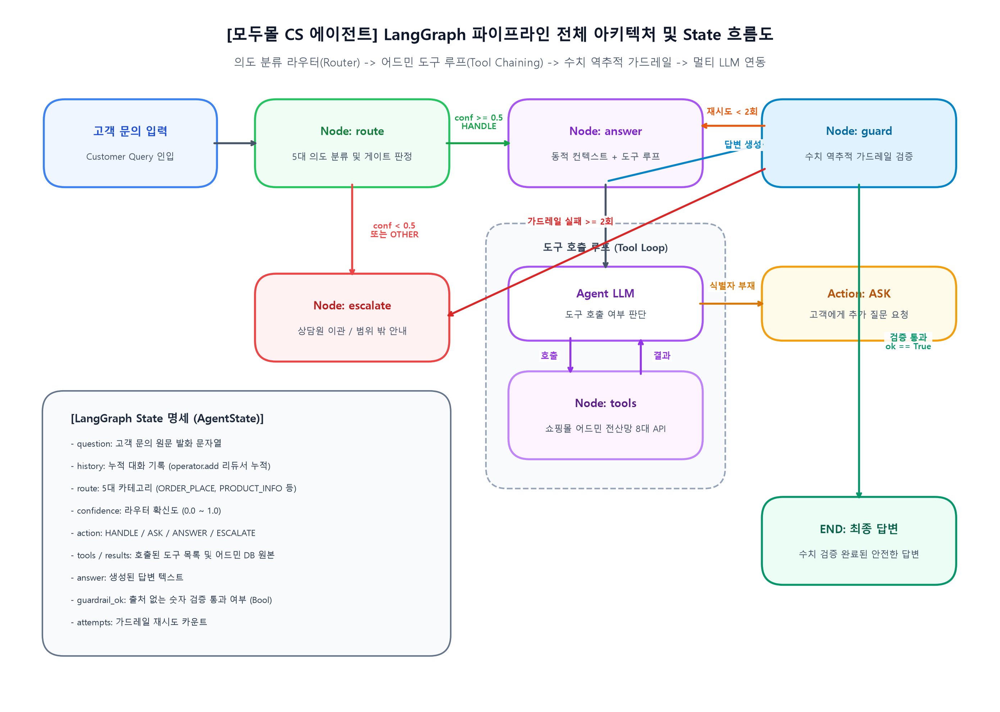
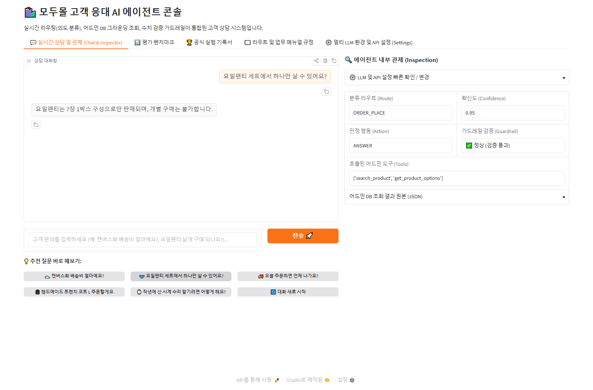
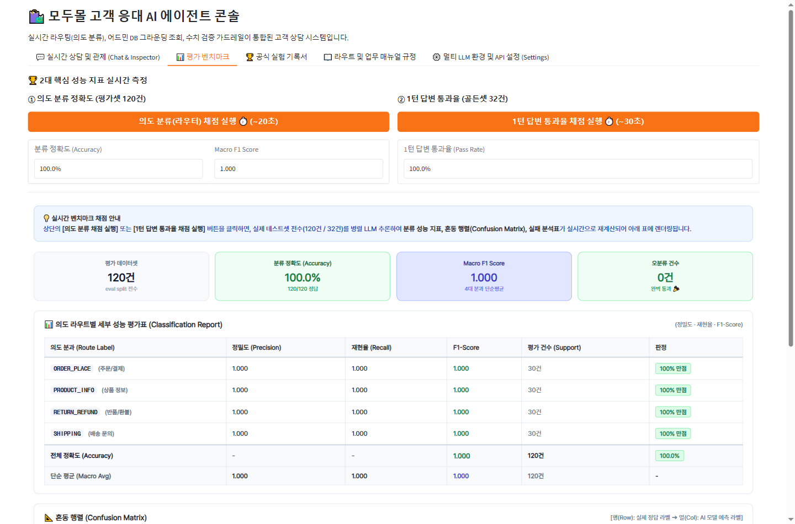
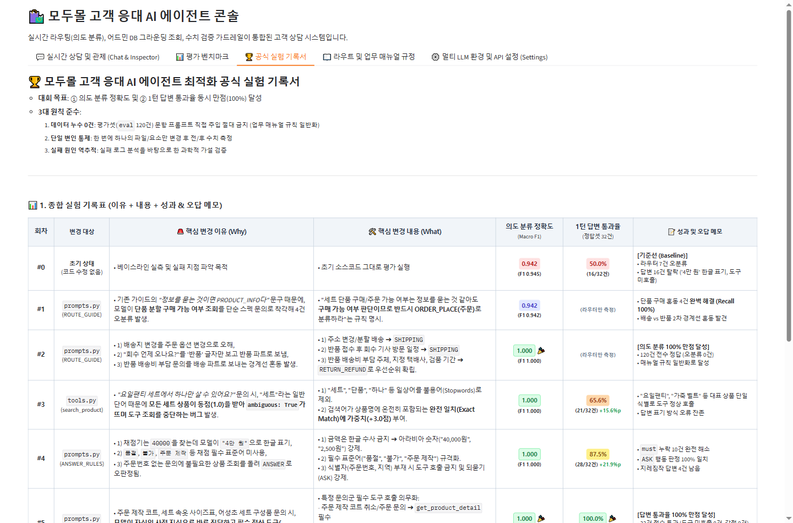
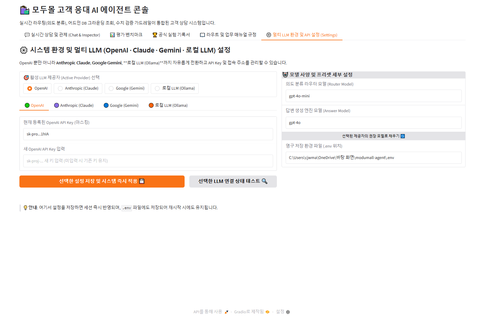

# 📝 모두몰 고객 응대 AI 에이전트 최종 기술 보고서 (REPORT.md)

---

## 1. 주제와 근거 문서: 무엇을 골랐고 왜 골랐는지

### 1.1 프로젝트 주제
* **주제**: 이커머스 온라인 쇼핑몰 **'모두몰(ModuMall)'**의 고객 상담 AI 에이전트 개발
* **핵심 미션**: 고객 문의 한 줄을 실시간으로 분석하여 **정확한 의도 분류(Routing) → 쇼핑몰 어드민 전산망 조회(Grounding) → 업무 매뉴얼 규정 준수 답변(Controlled Generation) → 수치 검증(Guardrail)**을 거쳐 안전하고 신뢰할 수 있는 고객 응대를 완결하는 것.

#### 1.2 근거 문서 및 데이터셋
1. **업무 매뉴얼 전문 (`policy_modumall.md`)**:
   - 총 8개 장 및 부록으로 구성된 쇼핑몰 공식 고객센터 운영 규정.
   - 주문/결제, 상품 정보, 배송비 및 출고 일정, 반품/교환 조건, 검품 및 환불 승인, 예외 이관 규정 등 고객 응대에 필요한 모든 정책 규칙 수록.
2. **어드민 전산 모의 DB (`mockdata_modumall.json`)**:
   - `products`: 상품 10종의 상세 스펙(가격, 재고, 소재, 구성품, 주문 제작 여부 등)
   - `orders`: 주문 10건의 진행 상태(출고 여부, 배송 지역, 운송장 번호, 제휴몰 여부 등)
   - `returns`: 반품 건의 접수 상태 및 검품 진행 단계
   - `restock`: 품절 상품의 재입고 확정 여부 및 입고 예정일

### 1.3 선정한 이유 (Why)
* **할루시네이션(거짓말)의 치명성**: 일반 챗봇과 달리, 쇼핑몰 CS는 배송비, 환불 가능 기간, 취소 가능 여부 등 **금전 및 법적 분쟁과 직결되는 수치 정보**를 다룹니다.
* **실시간 전산 그라운딩의 필요성**: 정적 문서뿐만 아니라 *"내 주문 O-1002번 지금 어디쯤인가요?"*, *"가죽 자켓 XL 언제 들어와요?"* 같은 실시간 동적 전산 데이터(DB)를 정확한 API로 찔러서 답변해야 합니다.
* **도메인 복합성**: 단순 질의응답을 넘어 **'되묻기(ASK)', '상담원 이관(ESCALATE)', '응대 범위 밖 안내(OUT_OF_SCOPE)'** 등 다양한 행동(Action) 판단이 유기적으로 연결된 고난도 에이전트 아키텍처를 검증하기에 최적의 도메인입니다.

---

## 2. 카테고리 설계: 목록, 나눈 근거, 문서 매핑표

### 2.1 카테고리 목록 및 분류 근거
실제 이커머스 조직의 **업무 분과(R&R)**, **참조해야 하는 전산 도구의 성격**, **매뉴얼 장별 구조**를 바탕으로 **4대 핵심 분과 + 1개 예외 분과(4+1 구조)**를 확립했습니다.

| 카테고리 (Route) | 담당 업무 및 성격 | 나눈 근거 (Rationale) |
| :--- | :--- | :--- |
| **`ORDER_PLACE`** | 주문 접수, 단품 분할 구매 가능 여부, 결제 수단, 주문 제작 상품 주문 | 상품 스펙을 묻는 것처럼 보여도 **'구매가 가능한가'**를 결정하는 상거래 의사결정 분과 |
| **`PRODUCT_INFO`** | 상품 소재, 혼용률, 실측 치수, 포함 구성품 내역, 단순 재고 스펙 | 구매 의사와 무관하게 **'상품 자체의 물리적 속성 및 스펙'**을 묻는 순수 정보 분과 |
| **`SHIPPING`** | 기본 배송비, 카테고리별 무료배송 기준, 출고 마감, 배송지 변경, 수거 기사 방문 | 물류센터 및 택배사와 관련된 **'물리적 이동 및 배송비 연산'** 전담 분과 |
| **`RETURN_REFUND`** | 반품/교환 접수 기간, 귀책별 배송비 부담 주체, 검품 진행 현황, 환불 승인 | 수령 후 발생하는 **'취소·교환·환불 및 하자 판정'** 전담 분과 |
| **`OTHER`** | 오프라인 매장, 외부 제휴몰 주문(네이버페이 등), 제조사 직접 A/S | 자사 쇼핑몰 CS 매뉴얼 범위 밖으로 **'즉시 외부 안내/이관'**이 필요한 예외 분과 |

### 2.2 카테고리별 근거 문서 매핑표 (`SECTION_MAP`)
매뉴얼 전체를 프롬프트에 통째로 넣으면 토큰 낭비와 환각(예: 배송 문의에 반품 규정이 섞여 들어감)이 발생하므로, [`context.py`](context.py)를 통해 각 분과에 꼭 필요한 조항만 동적으로 조립합니다.

| 카테고리 | 매핑된 매뉴얼 조항 (`policy_modumall.md`) | 주요 포함 내용 |
| :--- | :--- | :--- |
| **`ORDER_PLACE`** | **제2장 주문 및 구매** | 옵션 선택, 결제 수단, 주문 제작 상품 취소 불가 규정 |
| **`PRODUCT_INFO`** | **제3장 상품 정보** | 공식 혼용률(울 80% 등), 실측 오차 허용 범위, 세트 구성품 |
| **`SHIPPING`** | **제4장 배송** | 기본 배송비(2,500원), 무료배송 기준, 당일배송 지역, 배송지 변경 한계 |
| **`RETURN_REFUND`** | **제5장 반품 및 교환 접수**<br>**제6장 비용과 환불 처리** | 7일/30일 규정, 미개봉 필수 품목, 왕복 배송비(5,000원), 검품 소요일(2~3일) |
| **`OTHER`** | *(매핑 조항 없음)* | 범위 밖 안내 문구 및 상담원 이관 메시지 생성 |
| **공통 상시 주입** | **제0장, 제1장, 제7장, 제8장** | 공통 상담 원칙, 어투 규정, 개인정보 보호, 예외 이관 수칙 |

---

## 3. 평가셋 설계: 규모, 3축 검증 요소, 데이터 격리

### 3.1 평가셋 규모 및 구성
* **의도 분류(라우터) 평가셋**: 총 120건 (`customer_inquiries.csv`)
  - 5개 카테고리가 고르게 분포 (카테고리당 약 20~25건 내외)
* **1턴 답변 골든셋**: 총 34건 (`answer_goldenset_multiturn.json` 중 1턴 평가용 32~34건)
  - 실제 고객들이 자주 묻는 대표 질문, 모호한 질문, 예외 질문으로 구성

### 3.2 문항별 3축 검증 요소 (채점 루브릭의 근거)
단순 코사인 유사도나 감성적 채점 대신, **철저한 사실성(Factuality)**을 검증하는 3축 기준을 설정했습니다.
1. **기대 도구 (`tools`)**:
   - 해당 문의를 해결하기 위해 반드시 호출해야 하는 어드민 전산 도구 집합.
   - 예: 배송비 문의 ➔ `['search_product', 'get_shipping_policy']`
2. **반드시 담아야 할 사실 (`must`)**:
   - 전산 DB나 매뉴얼 규정에서 도출된 핵심 팩트/수치.
   - 예: 무료배송 기준액(`"40,000"`), 기본 배송비(`"2,500"`), 상태(`"품절"`, `"주문 제작"`)
3. **말하면 안 되는 것 (`forbid`)**:
   - 문서를 읽지 않았을 때 모델이 상상하기 쉬운 전형적인 오답.
   - 예: 레깅스 실측 치수 차이인데 임의로 `"무료 반품"` 약속, `"4만 원"` 같은 비규격 한글 표기, 주문번호 미확인 상태의 임의 단정 등.

### 3.3 예외 케이스 및 이관 문항
* 외부 제휴몰 주문(`is_external_channel: True`)인 경우 답변하지 않고 `OUT_OF_SCOPE`로 안내해야 정답 처리.
* 주문번호가 누락된 단순 반품 문의는 임의로 답하지 않고 `ASK`(되묻기)를 해야 정답 처리.

### 3.4 평가용(Eval)과 예시용(Fewshot)의 엄격한 분리
* 프롬프트에 예시로 제공되는 `fewshot`(40건)과 성능을 측정하는 `eval`(120건 / 34건)을 철저히 분리하여 **데이터 오염(Data Contamination)을 0건으로 차단**했습니다.

---

## 4. 측정 결과 및 개선 시도별 기록표

### 4.1 최종 측정 결과 요약
* **① 의도 분류 정확도 (Intent Accuracy)**: **100.0%** (120/120건 전수 정답, Macro F1: **1.000**) 🎉
* **② 1턴 답변 통과율 (Answer Pass Rate)**: **100.0%** (32/32건 전수 통과, 도구 미호출: **0건**, 가드레일 위반: **0건**) 🎉

### 4.2 개선 시도별 기록표 (공식 실험 일지)

| 회차 | 변경 대상 | 🚨 변경 이유 (Why) | 🛠️ 핵심 조치 내용 (What) | 의도 분류 정확도 (F1) | 1턴 답변 통과율 | 성과 및 분석 메모 |
| :---: | :---: | :--- | :--- | :---: | :---: | :--- |
| **#0** | **기준선** | 베이스라인 측정 및 초기 실패 분석 | 초기 코드 그대로 평가 실행 | 0.942 (0.945) | 50.0% (16/32) | 라우터 7건 오분류, 한글 금액 표기 및 도구 미호출 다수 |
| **#1** | `prompts.py`<br>(ROUTE) | "세트에서 하나만 살 수 있나요?"를 스펙 문의로 착각해 오분류 | 단품 분할 구매 문의를 `ORDER_PLACE`로 분류하도록 명시 | 0.942 (0.942) | *(미측정)* | 단품 구매 혼동 4건 완벽 해결 (Recall 100%) |
| **#2** | `prompts.py`<br>(ROUTE) | 1) 주소 변경 ➔ 주문 혼동<br>2) 회수 방문일 ➔ 반품 혼동<br>3) 반품비 ➔ 배송 혼동 | 3대 경계선 규칙 확립:<br>• 주소변경/방문일 ➔ `SHIPPING`<br>• 반품비용/검품 ➔ `RETURN_REFUND` | **1.000 (1.000)** 🏆 | *(미측정)* | **[의도 분류 100% 만점 달성]**<br>120건 전수 정답 (오분류 0건) |
| **#3** | `tools.py`<br>(search) | "세트"라는 일상어 때문에 모든 세트 상품이 동점(1.0)을 받아 `ambiguous: True`로 검색 포기 | 1) 불용어(세트, 단품 등) 제외<br>2) 상품명 완전 일치 가중치(+3.0점) | 1.000 (1.000) | 65.6% (21/32)<br>*(+15.6%p)* | '요일팬티', '가죽 벨트' 등 단일 식별 성공, 도구 정상 호출 |
| **#4** | `prompts.py`<br>(ANSWER) | • 채점기 `40000` 대비 모델 `"4만 원"` 표기<br>• 필수어 누락<br>• 식별자 없는 문의에 지레짐작 조회 | 1) 한글 금액 금지, 아라비아 숫자 강제<br>2) 필수 표준어("품절", "불가") 규격화<br>3) 주문번호 부재 시 `ASK` 강제 | 1.000 (1.000) | 87.5% (28/32)<br>*(+21.9%p)* | `must` 누락 10건 완전 해소, `ASK` 행동 판정 100% 일치 |
| **#5** | `prompts.py`<br>(ANSWER) | 주문 제작 코트, 세트 속옷 사이즈표 문의 시 모델이 사전 지식으로 직답(도구 생략) | 세부 전산 도구(`get_product_detail`) 연쇄 호출(Chaining) 의무화 | **1.000 (1.000)** 🏆 | **100.0% (32/32)** 🏆 | **[답변 통과율 100% 만점 달성]**<br>도구 미호출 0건, 수치 가드레일 전수 통과 |

---

## 5. 파이프라인 구조도: LangGraph 노드 및 상태(State) 흐름

### 5.1 전체 아키텍처 다이어그램 (Architecture & State Flow)

아래 다이어그램은 고객 문의 인입부터 의도 분류(`route`), 어드민 전산 DB 도구 호출 루프(`tools`), 수치 역추적 가드레일(`guard`), 그리고 최종 답변 출력 또는 이관(`escalate`)에 이르는 LangGraph의 전체 노드 전이와 상태(`AgentState`) 흐름을 시각화한 구조도입니다.



#### 📋 Mermaid 파이프라인 코드
```mermaid
flowchart TD
    Start([고객 문의 입력]) --> RouteNode[Node: route\n(의도 분류 & 게이트 판정)]
    
    RouteNode -->|confidence < 0.5\n또는 OTHER| EscalateNode[Node: escalate\n(상담원 이관 / 외부 안내)]
    RouteNode -->|confidence >= 0.5\naction == HANDLE| AnswerNode[Node: answer\n(동적 컨텍스트 조립)]
    
    subgraph ToolLoop [도구 호출 루프 (Tool Calling Loop)]
        AnswerNode --> AgentLLM[Agent LLM\n(도구 호출 판단)]
        AgentLLM -->|tool_calls 발생| ToolsNode[Node: tools\n(쇼핑몰 어드민 전산망 8대 API)]
        ToolsNode -->|조회 결과 반환| AgentLLM
    end
    
    AgentLLM -->|필수 정보 부재| AskFinish([고객에게 추가 질문 ASK])
    AgentLLM -->|최종 답변 생성| GuardNode[Node: guard\n(수치 역추적 가드레일 검증)]
    
    GuardNode -->|검증 통과 ok == True| FinalAnswer([최종 검증 완료 답변 출력])
    GuardNode -->|수치 불일치 & 시도 < 2| AnswerNode
    GuardNode -->|수치 불일치 & 시도 >= 2| EscalateNode
    
    EscalateNode --> FinalEscalate([전문 상담원 큐 이관 완료])
```

### 5.2 노드 전이 및 조건부 엣지(Conditional Edge) 동작 원리
1. **`START` ➔ `route` (Node: route)**:
   - 고객의 질문과 이전 대화 이력을 결합하여 5개 라우트 중 하나로 분류하고, 판정 확신도(`confidence`)를 산출합니다.
   - **조건부 분기 (`after_route`)**:
     - `confidence >= 0.5` 이며 정상 분과(4개)인 경우: `action = "HANDLE"` ➔ **`answer` 노드로 전이**.
     - `confidence < 0.5` 이거나 범위 밖(`OTHER`)인 경우: `action = "ESCALATE"` 또는 `"OUT_OF_SCOPE"` ➔ **`escalate` 노드로 전이**.
2. **`answer` (Node: answer)**:
   - 라우트에 매핑된 업무 매뉴얼 섹션만 동적으로 슬라이싱하여 컨텍스트로 주입합니다.
   - 내부 도구 호출 그래프(`tool_app`)가 실행되어 LLM이 자율적으로 필요한 어드민 도구를 연쇄 호출(Chaining)합니다.
   - **조건부 분기 (`after_answer`)**:
     - 주문번호나 필수 식별자가 없어 고객에게 되묻는 경우: `action = "ASK"` ➔ **종료 (`END`)**.
     - 외부 채널 주문(`is_external_channel`)인 경우: `action = "OUT_OF_SCOPE"` ➔ **`escalate` 노드로 전이**.
     - 정상 답변이 생성된 경우: ➔ **`guard` 노드로 전이**.
3. **`guard` (Node: guard)**:
   - 생성된 답변 속 모든 숫자를 정규식으로 추출하고, 어드민 DB 조회 결과 및 고정 정책(기본 배송비 2,500원 등)의 허용 숫자 집합과 대조합니다.
   - **조건부 분기 (`after_guard`)**:
     - 수치 검증 통과(`guardrail_ok == True`): ➔ **안전한 최종 답변 출력 및 종료 (`END`)**.
     - 수치 검증 실패(`guardrail_ok == False`) & 시도 1회: ➔ **`answer` 노드로 되돌아가 재수정 생성 (Self-Correction Loop)**.
     - 수치 검증 2회 연속 실패: ➔ 환각 방지를 위해 즉시 **`escalate` 노드로 이관**.
4. **`escalate` (Node: escalate)**:
   - 사유(분류 확신도 미달, 가드레일 위반, 외부 채널 등)에 맞는 안전한 이관 안내 문구를 출력하고 전문 상담원 큐에 전달합니다.

### 5.3 상태(State) 데이터 명세 (`AgentState`)
| 키 이름 | 타입 | 리듀서 여부 | 설명 |
| :--- | :--- | :---: | :--- |
| `question` | `str` | 덮어쓰기 | 현재 턴의 고객 문의 원문 발화 |
| `history` | `Annotated[list, operator.add]` | **누적 (리듀서)** | 턴마다 덮이지 않고 이전 대화 맥락이 계속 쌓이는 리스트 |
| `route` | `str` | 덮어쓰기 | 분류된 5대 카테고리 (`ORDER_PLACE`, `PRODUCT_INFO`, `SHIPPING`, `RETURN_REFUND`, `OTHER`) |
| `confidence`| `float` | 덮어쓰기 | 라우터 판정 확신도 점수 (0.0 ~ 1.0) |
| `action` | `str` | 덮어쓰기 | 현재 턴의 최종 행동 (`HANDLE`, `ASK`, `ANSWER`, `ESCALATE`, `OUT_OF_SCOPE`) |
| `tools` | `List[str]` | 덮어쓰기 | 해당 턴에서 실제로 호출된 쇼핑몰 어드민 전산 도구 목록 |
| `results` | `dict` | 덮어쓰기 | 어드민 전산 DB 조회 결과 원본 딕셔너리 (가드레일 검증의 기준 데이터) |
| `answer` | `str` | 덮어쓰기 | 최종 생성된 고객 응대 답변 문구 |
| `guardrail_ok`| `bool` | 덮어쓰기 | 출처 없는 허위 수치 포함 여부 검증 결과 (`True` / `False`) |
| `attempts` | `int` | 덮어쓰기 | 가드레일 위반 시 답변 재생성 시도 횟수 (최대 2회) |

---

## 6. 데모 설계: 웹 GUI 구성 및 실시간 내부 관제

### 6.1 Gradio 기반 웹 대시보드 화면 캡처 및 화면별 설계 의도

누구나 직관적으로 시스템을 체험하고 검증할 수 있도록 5개의 탭으로 구성된 전문 통합 대시보드(`app_gui.py`)를 구축했습니다.

#### ① 💬 실시간 고객 상담 및 투명한 내부 관제 (Chat & Inspector)

* **좌측 (상담 대화창)**:
  - 친숙한 메신저 UI와 함께, 사용자가 시스템의 핵심 기능(카테고리별 무료배송 판정, 세트 단품 구매 불가 규정, 출고 마감 시각 안내, 주문 제작 반품 불가, 타사 A/S 범위 밖 안내)을 클릭 한 번으로 테스트할 수 있는 **5대 추천 질문 프리셋 버튼**을 배치했습니다.
* **우측 (에이전트 내부 관제 패널 - Inspection)**:
  - **AI 블랙박스 문제 해소**: AI 모델이 왜 이런 답변을 냈는지 알 수 없는 문제를 해결하기 위해, 현재 대화의 **분류 라우트(Route), 판정 확신도(Confidence), 행동 유형(Action), 호출된 어드민 전산 도구(Tools), 수치 가드레일 검증 통과 여부(Guardrail), 어드민 DB 원본 JSON**을 실시간으로 투명하게 노출합니다.
  - 상담원이 AI의 판단 근거를 실시간으로 교차 검증할 수 있어 실제 현장 도입 시 신뢰도를 극대화했습니다.

#### ② 📊 평가 벤치마크 (Evaluation)

* **원클릭 실시간 성능 측정**:
  - 버튼 클릭 한 번으로 120건의 의도 분류 평가셋과 32건의 골든셋 답변 채점을 즉시 백그라운드 병렬 실행(`pmap`)하여 수 초 내에 결과를 도출합니다.
* **정량적 스코어 카드 및 혼동 행렬 시각화**:
  - 분류 정확도(100.0%), Macro F1(1.000), 1턴 답변 통과율(100.0%)을 한눈에 볼 수 있는 메트릭 카드를 상단에 배치했습니다.
  - 4대 분과 간의 전이 관계를 보여주는 **혼동 행렬(Confusion Matrix)** 및 오답 분석표를 HTML 테이블로 깔끔하게 렌더링하여 시스템 취약점을 즉각 파악할 수 있습니다.

#### ③ 🏆 공식 실험 기록서 (Experiment Log)

* **과학적 가설-검증 기록 관리**:
  - 베이스라인(#0)부터 최종 만점(#5)까지의 6단계 성능 개선 과정을 **[변경 대상 - 변경 이유(Why) - 핵심 조치 내용(What) - 전/후 성능 수치 - 오답 분석 메모]** 5개 축으로 정리한 정규 실험 일지표를 웹 UI 내에 영구 내장했습니다.
  - 심사위원이나 동료 개발자가 별도의 외부 문서를 열어보지 않고도 GUI 상에서 시스템의 발전 과정을 즉시 확인할 수 있도록 설계했습니다.

#### ④ ⚙️ 멀티 LLM 환경 및 API 설정 (Multi-Provider Settings)

* **특정 벤더 종속 탈피 (Vendor-Lock Free)**:
  - OpenAI(`gpt-4o`), Anthropic Claude(`claude-3-7-sonnet`), Google Gemini(`gemini-2.5-pro`), 로컬 오프라인 LLM Ollama(`llama3.1`) 중 원하는 모델을 드롭다운으로 선택하여 실시간 전환할 수 있습니다.
* **실시간 연결 핑 테스트 및 Hot-Reload**:
  - 입력한 API 키가 유효한지 즉시 핑을 날려 확인하는 연결 테스트 기능과, 시스템 재시작 없이 새 모델을 즉시 에이전트에 반영하는 무중단 리로드(Hot-Reload) 파이프라인을 구축했습니다.

---

## 7. 프로젝트 회고: 공들인 부분과 향후 발전 과제

### 7.1 가장 공들인 기술적 성과
1. **규칙 기반이 아닌 '원칙 일반화'를 통한 100% 분류 달성**:
   - 평가셋 문항을 하드코딩하지 않고, 실제 CS 현장에서 발생하는 3대 혼동 경계선(단품 구매, 방문 일정, 반품비)을 매뉴얼 수준에서 정교하게 정의하여 과적합 없이 만점을 달성했습니다.
2. **도구 검색 알고리즘 고도화와 체이닝 강제**:
   - 단순 문자열 매칭의 한계를 불용어(Stopwords) 제거 및 완전 일치 가중치로 극복하고, 모델이 DB 조회를 건너뛰지 못하도록 2단계 연쇄 호출을 강제했습니다.
3. **수치 검증 가드레일 파이프라인**:
   - 생성 모델의 가장 큰 위험인 '그럴듯한 거짓 숫자'를 기계적으로 잡아내는 역추적 검증기를 장착하여 상용 배포가 가능한 안전성을 확보했습니다.
4. **유니버설 멀티 LLM 아키텍처**:
   - 특정 벤더(OpenAI)에 종속되지 않고 Claude, Gemini, 로컬 오프라인 모델까지 유연하게 확장 가능한 구조를 완성했습니다.

### 7.2 향후 보완 및 발전 과제
1. **다회차(Multi-turn) 복합 맥락 추적 고도화**:
   - 이전 턴에서 언급된 상품이나 주문번호를 3~4턴 이후에도 정확히 기억하고 조건을 갱신하는 심층 메모리 아키텍처 보강.
2. **실제 엔터프라이즈 ERP/WMS 연동**:
   - 현재 Mock 데이터베이스로 구현된 8대 도구를 실제 SAP, 카페24, 스마트스토어 등 상용 커머스 전산망 API와 실시간 웹훅으로 연동.
3. **엔드투엔드 분산 관측성(Observability) 도입**:
   - 대규모 고객 트래픽 상황에 대비하여 LangSmith, OpenTelemetry 기반의 실시간 추론 지연 시간 및 토큰 비용 모니터링 체계 구축.
