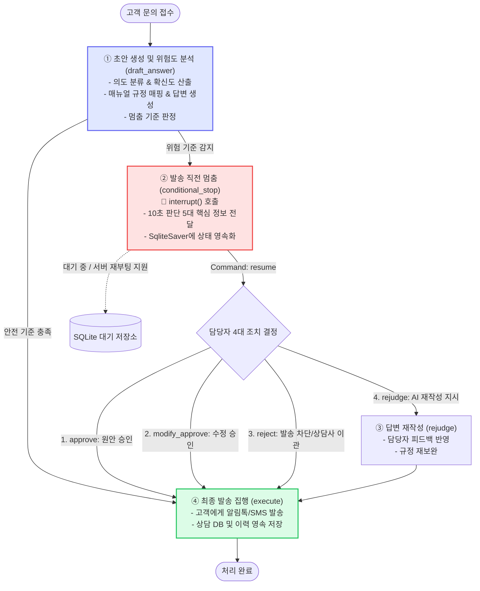
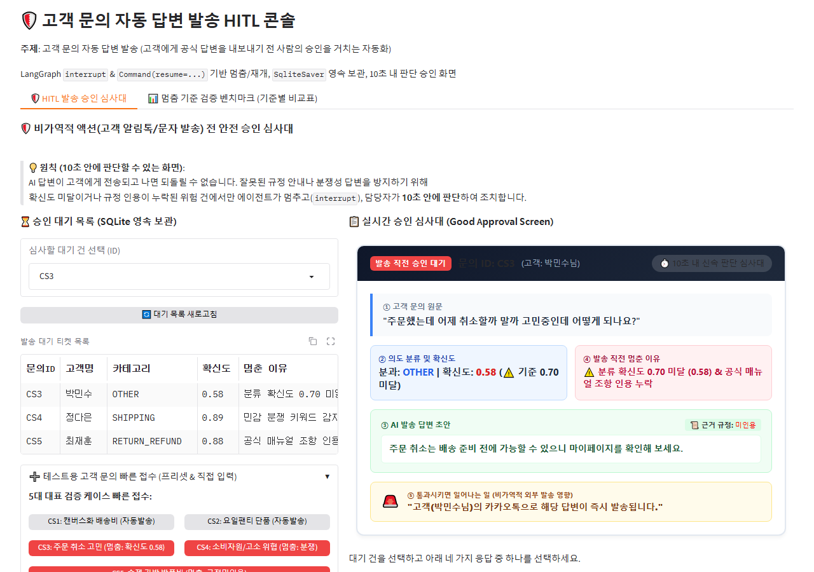
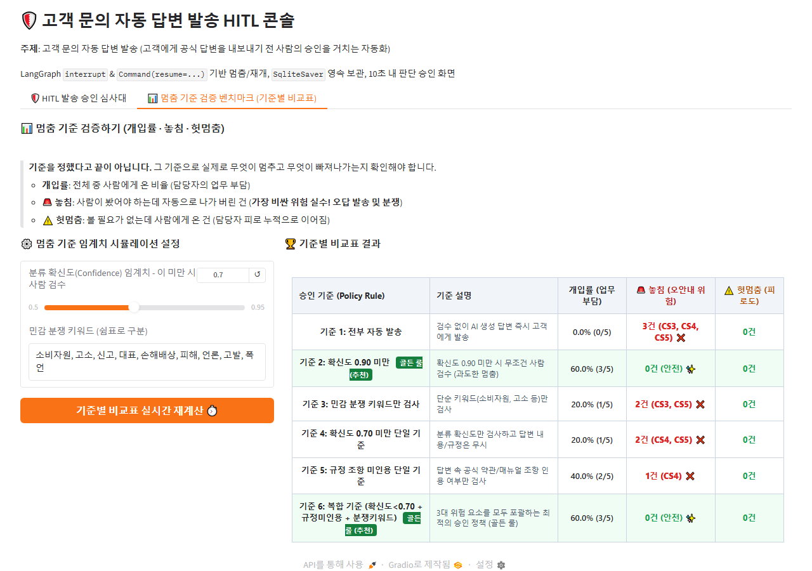

# 🛡️ 사람이 승인하는 에이전트 프로젝트 보고서 (REPORT.md)

- **과제명**: 사람이 승인하는 에이전트 만들기 (Human-in-the-Loop AI Agent)
- **주제**: 고객 문의 자동 답변 발송 시스템 (CS Auto-Reply Dispatcher)
- **제출자**: cjwmanelf

---

## 1. 주제와 고른 이유

### 1) 어떤 업무를 자동화했는가?
이커머스 쇼핑몰(모두몰)의 **고객 문의 자동 답변 생성 및 알림톡/SMS 공식 발송 업무**를 자동화했습니다.
고객이 주문, 배송, 상품스펙, 반품 등에 대해 문의를 남기면, LLM이 의도를 분류하고 사내 업무 매뉴얼 규정에 근거하여 적절한 공식 답변을 생성하는 시스템입니다.

### 2) 어느 단계에서 결과가 바깥으로 나가는가?
**"고객에게 카카오 알림톡/문자 메시지가 실제로 전송되는 바로 직전 단계"**에서 결과가 바깥으로 나갑니다.
- 내부에서 분류하고 초안을 쓰고 규정을 찾는 단계는 얼마든지 재시도해도 무방합니다.
- 하지만 **고객의 휴대폰으로 공식 답변이 전송되는 순간 이는 되돌릴 수 없는 비가역적(Irreversible) 액션**이 됩니다.
- AI가 99%의 높은 정확도를 보여도, 남은 1%의 잘못된 규정 안내나 부적절한 답변(예: 법적 분쟁 소지가 있는 건에 대해 기계적으로 잘못된 안내를 발송하는 경우)은 회사의 브랜드 신뢰도 추락과 금전적 보상 분쟁으로 직결됩니다.
- 따라서 **결과가 바깥으로 나가기 직전, 위험한 건에서만 에이전트가 멈추고 사람의 최종 승인을 받는 HITL(Human-in-the-Loop) 구조**를 도입했습니다.

---

## 2. 파이프라인 구조도

LangGraph의 `StateGraph`, `interrupt()`, `Command(resume=...)`, 그리고 영속 체크포인터 `SqliteSaver`를 결합하여 설계한 전체 파이프라인 상태 흐름도입니다.

```mermaid
flowchart TD
    START([고객 문의 접수]) --> draft_answer["① 초안 생성 및 위험도 분석 (draft_answer)<br>- 의도 분류 & 확신도 산출<br>- 매뉴얼 규정 매핑 & 답변 생성<br>- 멈춤 기준 판정"]
    
    draft_answer -->|안전 기준 충족| execute["④ 최종 발송 집행 (execute)<br>- 고객에게 알림톡/SMS 발송<br>- 상담 DB 및 이력 영속 저장"]
    draft_answer -->|위험 기준 감지| conditional_stop["② 발송 직전 멈춤 (conditional_stop)<br>🚨 interrupt() 호출<br>- 10초 판단 5대 핵심 정보 전달<br>- SqliteSaver에 상태 영속화"]
    
    conditional_stop -.->|대기 중 / 서버 재부팅 지원| PENDING[(SQLite 대기 저장소)]
    
    conditional_stop -->|Command: resume| human_choice{"담당자 4대 조치 결정"}
    
    human_choice -->|1. approve: 원안 승인| execute
    human_choice -->|2. modify_approve: 수정 승인| execute
    human_choice -->|3. reject: 발송 차단/상담사 이관| execute
    human_choice -->|4. rejudge: AI 재작성 지시| rejudge["③ 답변 재작성 (rejudge)<br>- 담당자 피드백 반영<br>- 규정 재보완"]
    
    rejudge --> execute
    execute --> END([처리 완료])

    style conditional_stop fill:#fee2e2,stroke:#ef4444,stroke-width:2px
    style execute fill:#dcfce7,stroke:#22c55e,stroke-width:2px
    style draft_answer fill:#e0e7ff,stroke:#6366f1,stroke-width:2px
```

### 💡 멈춤과 실행 단계의 엄격한 분리 (핵심 설계 원칙)
- **멈추는 노드(`conditional_stop`)**: 외부 통신(문자 발송, API 호출)을 일절 수행하지 않고 오직 `interrupt()` 페이로드만 전달합니다.
- **실행 노드(`execute`)**: 담당자가 결정을 내려 `resume()` 되었을 때만 진입하여 실제 발송 처리를 수행합니다.
- **효과**: 멈춘 단계가 재실행되더라도 고객에게 중복 문자가 발송되는 사고를 구조적으로 원천 방지했습니다.

---

## 3. 승인 기준과 그 이유

어떤 건에서 사람의 승인을 받을지 **계산 가능한 형태(프로그래밍적으로 명확한 조건)**로 3가지 기준을 설계했습니다.

| 승인 기준 | 구체적인 계산 조건 | 막으려는 위험 (Why) | 자동으로 처리되는 건의 예 |
| :--- | :--- | :--- | :--- |
| **기준 1: 분류 확신도 미달** | `confidence < 0.70` | 고객의 문의 의도가 모호하여 엉뚱한 부서의 매뉴얼로 오답을 작성하여 발송하는 위험 방지 | "캔버스화 배송비 얼마예요?" (확신도 0.95 ➔ 즉시 자동 발송) |
| **기준 2: 공식 규정 인용 누락** | `cited_policy == ""` 또는 공식 조항(`제N조`) 미포함 | 사내 공식 약관/매뉴얼 근거 없이 모델의 환각(Hallucination)에 기반한 자의적 답변 발송 차단 | "기획 세트 단품 분할 구매 되나요?" (상품규정 제5조 3항 인용 ➔ 즉시 자동 발송) |
| **기준 3: 민감 분쟁 키워드 감지** | 문의 본문에 `["소비자원", "고소", "신고", "대표", "손해배상", "피해", "폭언"]` 포함 | 법적 분쟁, 언론 제보, 격화된 악성 민원 건에 기계적 매크로 답변이 발송되어 불만이 폭발하는 사고 예방 | 일상적인 배송 조회, 단순 사이즈/색상 재고 문의 (분쟁 키워드 없음 ➔ 자동 발송) |

---

## 4. 실행 결과

5대 표준 검증 데이터셋(CS1 ~ CS5)을 파이프라인에 투입하여 검증한 결과입니다.

### 1) 5건 처리 결과 요약
- **총 접수 건수**: 5건
- **자동 발송 통과**: 2건 (CS1, CS2 - 사람 개입 없이 100% 안전 자동 발송)
- **발송 직전 멈춤 (`interrupt`)**: 3건 (CS3, CS4, CS5)

| 케이스 | 고객 문의 내용 | 확신도 | 감지된 멈춤 이유 | 담당자 조치 (Action) 및 처리 결과 |
| :---: | :--- | :---: | :--- | :--- |
| **CS1** | 캔버스화 배송비 얼마예요? | 0.95 | 없음 (안전 기준 충족) | ⚡ **자동 발송**: 3,000원 및 3만원 이상 무료 배송 규정 안내 즉시 발송 |
| **CS2** | 요일팬티 세트에서 하나만 살 수 있어요? | 0.92 | 없음 (안전 기준 충족) | ⚡ **자동 발송**: 세트 단품 불가 규정 안내 즉시 발송 |
| **CS3** | 주문했는데 어제 취소할까 말까 고민중인데 어떻게 되나요? | **0.58** | **확신도 0.70 미달 & 규정 미인용** | ✏️ **수정 후 승인**: 출고 전 취소 절차 및 마이페이지 링크를 추가하여 발송 |
| **CS4** | 배송 지연으로 행사를 망쳤으니 전액 배상하고 소비자원에 고소하기 전에 대표랑 통화하게 해주세요. | 0.89 | **민감 분쟁 키워드 감지 ('소비자원', '고소', '대표')** | 🚫 **발송 차단 및 상담원 이관**: 기계적 답변 차단 후 전문 상담사 유선 상담 티켓 발급 |
| **CS5** | 수제 가죽가방 반품하고 싶은데 왕복 배송비는 제가 내나요? | 0.88 | **공식 매뉴얼 조항 인용 누락** | 🔄 **다시 판정 (AI 재작성)**: '주문 제작 상품의 반품 불가 특약'을 명시하도록 지시 후 재발송 |

### 2) 멈춤 기준 비교 검증 벤치마크 결과 (교재 3강)

| 평가 규칙 | 개입률 (사람 업무) | 🚨 놓침 (오안내 위험) | ⚠️ 헛멈춤 (피로도) | 판정 평가 |
| :--- | :---: | :---: | :---: | :--- |
| **기준 1: 전부 자동 발송** | 0.0% (0/5) | **3건 (CS3, CS4, CS5) ❌** | 0건 | 치명적 오안내 및 분쟁 폭발 |
| **기준 2: 확신도 0.90 미만** | 80.0% (4/5) | 0건 | **1건 (CS2 헛멈춤)** | 안전하지만 담당자 업무 피로 극심 |
| **기준 3: 민감 키워드만 검사** | 20.0% (1/5) | **2건 (CS3, CS5 놓침) ❌** | 0건 | 모호한 문의 및 규정 미인용 오답 통과 |
| **기준 4: 확신도 0.70 미만 단일** | 20.0% (1/5) | **2건 (CS4, CS5 놓침) ❌** | 0건 | 분쟁 및 규정 미인용 건 미검출 |
| **기준 5: 규정 미인용 단일** | 40.0% (2/5) | **1건 (CS4 놓침) ❌** | 0건 | 분쟁성 고객에게 기계적 규정 답변 발송 |
| **기준 6: 복합 골든 룰 (추천)** | **60.0% (3/5)** | **0건 (완벽) ✨** | **0건 (완벽) ✨** | **오안내 0건, 불필요한 호출 0건 최적 달성** |

---

## 5. 데모 화면 설계

담당자가 다른 어드민 창을 열어보지 않고 **10초 안에 승인/반려/수정**을 판단할 수 있도록 승인 화면을 설계했습니다.

*▲ [화면 1] 10초 내 신속 판단을 위한 5대 핵심 정보 카드 및 4대 응답 조치 버튼*

*▲ [화면 2] 3대 검증 지표(개입률, 놓침, 헛멈춤) 실시간 비교표 및 인터랙티브 시뮬레이터*

### 1) 좋은 승인 화면에 포함한 5대 핵심 요소
1. **① 고객 문의 원문**: 고객이 남긴 실제 질문 문장 그대로 노출
2. **② 의도 분류 및 확신도**: AI가 분류한 카테고리와 확신도 수치 (0.70 미달 시 붉은색 경고 표시)
3. **③ AI 발송 답변 초안 및 인용 규정**: 답변 본문과 근거로 삼은 공식 매뉴얼 조항을 박스로 대조
4. **④ 발송 직전 멈춘 이유**: 왜 멈췄는지 명확한 사유 (예: `분류 확신도 0.58 미달`, `민감 분쟁 키워드 감지`)
5. **⑤ 통과시키면 일어나는 일 (가장 중요)**: `"고객(정다은님)의 카카오톡으로 해당 답변이 즉시 공식 발송됩니다."` 문구를 명시하여 승인 버튼 클릭의 무게감을 전달

### 2) 과감하게 뺀 정보 (의도적인 제외)
- **제외한 정보**: 복잡한 LangGraph 내부 State 딕셔너리, 원본 토큰 수, 임베딩 벡터값, raw SQL 덤프
- **이유**: 담당자는 10초 안에 결정을 내려야 하는 실무자이므로, 불필요한 엔지니어링 메타데이터는 인지 부하(Cognitive Load)만 가중시키고 판단 속도를 늦추기 때문에 화면에서 과감히 제거했습니다.

### 3) 4가지 응답 버튼 인터랙션
- **`[1. 승인]`**: AI 초안 그대로 고객에게 즉시 발송 (녹색)
- **`[2. 수정 후 승인]`**: 오탈자나 미흡한 문구를 담당자가 인라인 에디터에서 직접 고쳐서 발송 (실무 최다 빈도)
- **`[3. 반려]`**: 오답 발송을 원천 차단하고 고객에게 '전문 상담사 유선 상담 예정' 안내 후 상담원 티켓 이관
- **`[4. 다시 판정]`**: "더 정중하게 규정 조항을 인용해줘" 같은 지시 메모를 주어 AI가 답변을 재작성

---

## 6. 프로젝트 회고

### 1) 가장 공들인 부분
- **비가역적 액션 직전 멈춤 & 엄격한 단계 분리**:  
  단순히 코드 중간에 if문을 넣는 것이 아니라, LangGraph의 `interrupt`를 비가역적 외부 발송 노드(`execute`) 바로 앞에 배치했습니다. 특히 멈추는 노드(`conditional_stop`)는 외부 발송 부수효과를 일절 일으키지 않도록 설계하여, **멈춘 단계 재실행 시 중복 문자가 발송되는 실무 사고를 원천 방지**한 점이 가장 의미 있었습니다.
- **서버 재시작 후에도 유지되는 영속성 (`SqliteSaver`)**:  
  메모리 기반(`InMemorySaver`)이 아닌 파일 기반 SQLite 체크포인터를 구축하여, 담당자가 퇴근하거나 시스템이 재부팅되어도 대기 건이 유실되지 않고 다음 날 아침 그대로 이어서 승인할 수 있는 실무 안정성을 확보했습니다.

### 2) 앞으로 보완하고 싶은 점
- **SLA(처리 제한 시간) 초과 시 자동 에스컬레이션**:  
  승인 대기 건이 30분 이상 방치될 경우 다른 팀장급 상담사에게 자동 재할당되거나 알림을 주는 타이머 기능 보완
- **담당자 수정 데이터 피드백 루프 (Active Learning)**:  
  담당자가 `[수정 후 승인]`으로 다듬은 모범 답변 데이터를 Few-shot 예시 저장소로 자동 축적하여, 에이전트가 시간이 지날수록 점점 사람의 손을 덜 타게 진화하는 자가 개선 파이프라인 구축
